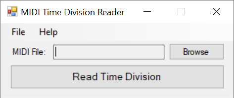

# MIDI Time Division Reader

Overview
------------

MIDI Time Division Reader is an extremely simple and lightweight program that reads the time division value of a MIDI file and displays it to the user.

Usage
------------

1. Click the "Browse" button next to the box labeled "MIDI File:" to open a MIDI file for reading, or simply drag and drop a single MIDI file to open it for reading.

2. Click the "Read Time Division" button to read the time division value of the MIDI file.

Limitations
------------

- Only MIDIs created under the MIDI 1.0 specification are supported

References
------------

To learn more about the MIDI 1.0 specification, visit the links below:
- MIDI File Format Specifications: https://github.com/colxi/midi-parser-js/wiki/MIDI-File-Format-Specifications
- The MIDI File Format: https://www.csie.ntu.edu.tw/~r92092/ref/midi/
